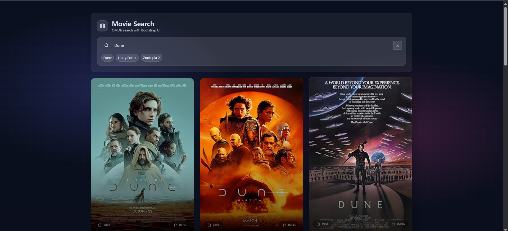

# 🎬 Movie Search App

A modern and responsive movie search application built with **React**, **Bootstrap**, and the **OMDb API**.  
It features a clean glassmorphism UI, real-time search, loading skeletons, and direct links to IMDb.

---

## 📸 Screenshots

<p align="center">
  
  
</p>

---

## ✨ Features

- 🔍 Search movies by title (powered by OMDb API)
- 💎 Glassmorphism-inspired UI
- ⏳ Skeleton loaders while fetching data
- 📅 Movie year & type display
- ⭐ Direct link to IMDb pages
- 📱 Fully responsive layout
- ❌ Clear search with one click
- ⚡ AbortController to cancel stale requests

---

## 🛠️ Tech Stack

- **React**
- **Bootstrap 5**
- **Lucide React Icons**
- **OMDb API**
- **Custom CSS (glass UI effects)**

---

## 🚀 Getting Started

### 1. Clone the repository
```bash
git clone https://github.com/your-username/movie-search-app.git
cd movie-search-app
```
### 2. Install dependencies
```bash
npm install
```
### 3. Add your OMDb API key
Open App.jsx and replace:
```bash
const API_KEY = "YOUR_API_KEY_HERE";
```
Get a free API key from:
👉 https://www.omdbapi.com/apikey.aspx

### 4. Run the app
```bash
npm run dev
```
---

## 📂 Project Structure
```
src/
├── components/
│   ├── MovieCard.jsx
│   ├── MovieList.jsx
│   ├── SearchBar.jsx
│   └── SkeletonGrid.jsx
├── App.jsx
├── styles.css
└── main.jsx
```

---

## 🧠 Notes

Uses AbortController to cancel in-flight requests while typing

Gracefully handles empty searches and API errors

Fallback image is shown when a movie poster is unavailable

---

## 📄 License

MIT License — free to use, modify, and share.
